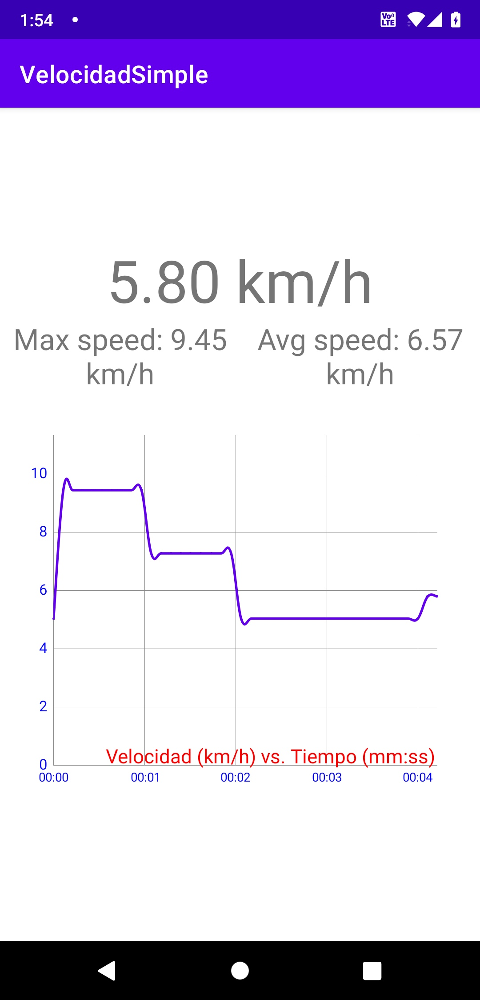
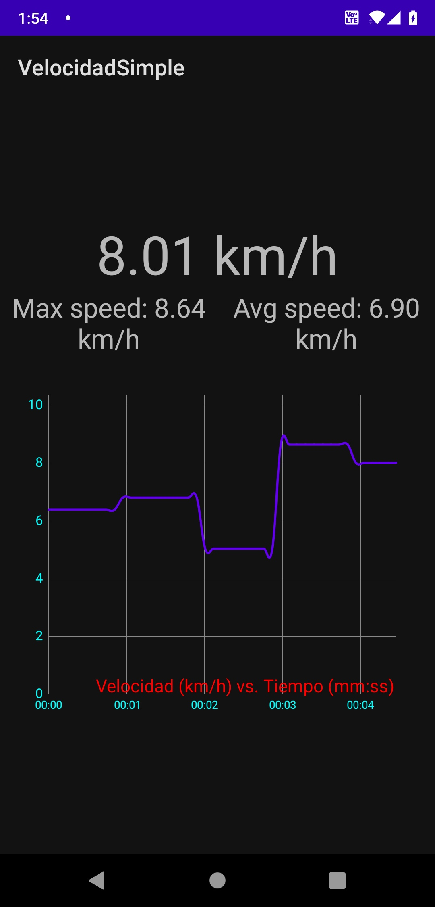

# VelocidadSimple GPS Speedometer

## Overview

VelocidadSimple is a GPS speedometer app on Android platform that uses the user's location to calculate their speed in km/h. The app also displays the maximum and average speed, as well as a line chart of the user's speed over time.

## Features

- Displays current speed, average speed, and maximum speed
- Plots speed over time on a line chart
- Automatically scales the y-axis of the line chart to fit the maximum speed
- Supports both light and dark mode

## Requirements

- Android device with GPS sensor
- Android 6.0 (Marshmallow) or later
- Location permission

## Installation

Download the APK file from the [latest release](https://github.com/voidregreso/VelocidadSimple/releases/latest), then install & run.

## Usage

1. Launch the app.
2. Grant location permission if requested.
3. Wait for the GPS to locate your position.
4. The current speed, average speed, and maximum speed will be displayed at the top of the screen.
5. The line chart below displays your speed over time. The x-axis shows the time in minutes and seconds, while the y-axis shows the speed in km/h.

## Screenshots

## Credits

This app was developed by [Adolfo Lorenzo Cristóbal Pérez](https://github.com/voidregreso).

The following third-party libraries were used in this app:

- [MPAndroidChart](https://github.com/PhilJay/MPAndroidChart) - for the line chart.

## License

This app is released under the [MIT License](https://github.com/voidregreso/VelocidadSimple/LICENSE)